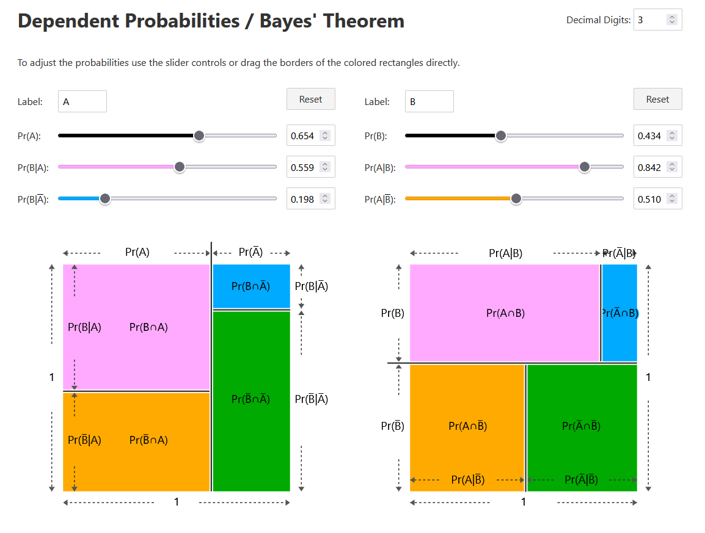

[Live Demo](https://static.laszlokorte.de/stochastic/) | [Short demo video](https://www.youtube.com/watch?v=-IMmclXe_V4&t=4s)

# Dependent probabilities explained geometrically

Above you see two squares of side length 1x1, i.e. area of one. Both represent the sample space two random events.

The total area of 1 is partitioned into 4 colored areas. The four areas represent the probabilities of each possible outcome:

   * A and B
   * A and not B
   * not A and B
   * not A and not B

Each colored area in the right square has the same area as the matching colored area in the left square. The rectangles are just packed differently. In the left square the colored rectangles are squished so that the pink and orange rectangles have the same width (blue and green respectively). In the right square the rectangles are squished to make the pink and blue rectangle the same height (orange and green respectively).

The alignment if the rectangles allows to not interpret their areas as probabilities but also their side lengths. In the left square the widths of the rectangles correspond to the probability of a single event (labeled A by default) and it's complement. In the right square the height of the rectangles correspond to the probability of the second event (named B by default).

The rectangle heights in the left square and the rectangles widths in the right square correspond to the dependent probabilities.

By dragging the sliders you experience how the the whole system has only three degrees of freedom and how the dependent probabilities P(A|B) and P(B|A) relate to each other in a non-linear and sometimes surprising way.

Try to find a configuration in which a colored rectangle on the left side is very shallow but the same colored rectangle on the right side is really wide.

Bayes theorem corresponds to the conversion of the side lengths of one rectangle to the side lengths of the other same colored rectangle.
